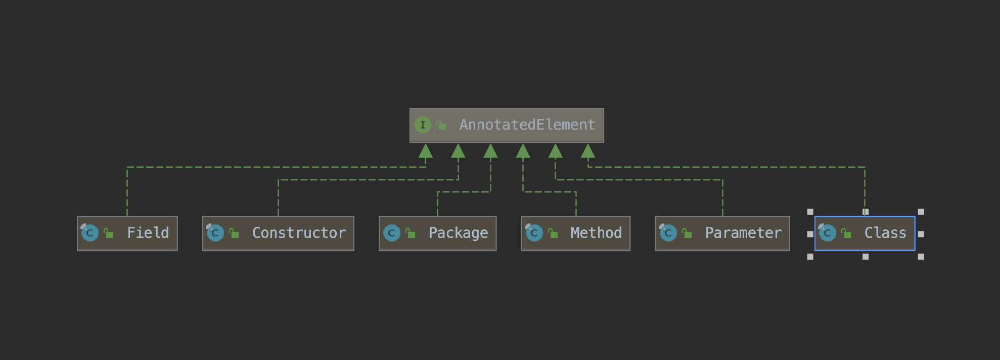

# java 注解


<B>注解的本质就是一个接口，并且继承了java.lang.annotation.Annotation</B>

```
package java.lang.annotation;

public interface Annotation {
    boolean equals(Object obj);

    int hashCode();

    String toString();

    Class<? extends Annotation> annotationType();
}

```

```
package annotation;

import java.lang.annotation.ElementType;
import java.lang.annotation.Retention;
import java.lang.annotation.RetentionPolicy;
import java.lang.annotation.Target;

@Retention(RetentionPolicy.RUNTIME)
@Target({ElementType.TYPE_USE, ElementType.METHOD})
public @interface A {
    
    String value() default "T";

    String value1() default "T1";
}
```


```
Compiled from "A.java"
public interface annotation.A extends java.lang.annotation.Annotation {
  public abstract java.lang.String value();
  public abstract java.lang.String value1();
}

```

```
Classfile /D:/workspace-vscode/ludius_annotate/bin/annotation/A.class
  Last modified 2023-9-6; size 477 bytes
  MD5 checksum 7f860c01998b81cae4b9d3db3ad2cade
  Compiled from "A.java"
public interface annotation.A extends java.lang.annotation.Annotation
  minor version: 0
  major version: 52
  flags: ACC_PUBLIC, ACC_INTERFACE, ACC_ABSTRACT, ACC_ANNOTATION
Constant pool:
   #1 = Class              #2             // annotation/A
   #2 = Utf8               annotation/A
   #3 = Class              #4             // java/lang/Object
   #4 = Utf8               java/lang/Object
   #5 = Class              #6             // java/lang/annotation/Annotation
   #6 = Utf8               java/lang/annotation/Annotation
   #7 = Utf8               value
   #8 = Utf8               ()Ljava/lang/String;
   #9 = Utf8               AnnotationDefault
  #10 = Utf8               T
  #11 = Utf8               value1
  #12 = Utf8               T1
  #13 = Utf8               SourceFile
  #14 = Utf8               A.java
  #15 = Utf8               RuntimeVisibleAnnotations
  #16 = Utf8               Ljava/lang/annotation/Retention;
  #17 = Utf8               Ljava/lang/annotation/RetentionPolicy;
  #18 = Utf8               RUNTIME
  #19 = Utf8               Ljava/lang/annotation/Target;
  #20 = Utf8               Ljava/lang/annotation/ElementType;
  #21 = Utf8               TYPE_USE
  #22 = Utf8               METHOD
{
  public abstract java.lang.String value();
    descriptor: ()Ljava/lang/String;
    flags: ACC_PUBLIC, ACC_ABSTRACT
    AnnotationDefault:
      default_value: s#10
  public abstract java.lang.String value1();
    descriptor: ()Ljava/lang/String;
    flags: ACC_PUBLIC, ACC_ABSTRACT
    AnnotationDefault:
      default_value: s#12}
SourceFile: "A.java"
RuntimeVisibleAnnotations:
  0: #16(#7=e#17.#18)
  1: #19(#7=[e#20.#21,e#20.#22])
```

## 分类
- 标准注解
- 元注解
- 自定义注解

### 标准注解
- @Override 标记一个方法是覆写父类方法
- @Deprecated 标记一个元素为已过期，避免使用
​ 支持的元素类型为：CONSTRUCTOR, FIELD, LOCAL_VARIABLE, METHOD, PACKAGE, PARAMETER, TYPE
- @SuppressWarnings 
可以标注在类、字段、方法、参数、构造方法，以及局部变量上。
作用：告诉编译器忽略指定的警告，不用在编译完成后出现警告信息

### 元注解
元注解包含以下五种： 
- @Retention
- @Target
- @Documented
- @Inherited
- @Repeatable 

#### @Retention
标明自定义注解的生命周期

```
@Retention(RetentionPolicy.RUNTIME)
```
- RetentionPolicy.SOURCE 
  源代码java文件，生成的class文件中就没有该信息了
- RetentionPolicy.CLASS 
class文件中会保留注解，但是jvm加载运行时就没有了
- RetentionPolicy.RUNTIME 
运行时，如果想使用反射获取注解信息，则需要使用RUNTIME，反射是在运行阶段进行反射的


#### @Target
描述自定义注解的使用范围，允许自定义注解标注在哪些Java元素上
```
@Target(ElementType.TYPE, ElementType.METHOD)
```
- ElementType.TYPE	
  类、接口、注解、枚举
- FIELD	
  属性
- MEHOD	
- 方法
- PARAMETER	
  方法参数
- CONSTRUCTOR	
  构造函数
- LOCAL_VARIABLE	
局部变量(如循环变量、catch参数)
- ANNOTATION_TYPE	
注解
- PACKAGE	
包
- TYPE_PARAMETER	
泛型参数 jdk1.8
- TYPE_USE	
任何元素 jdk1.8

#### @Inherited 
是否可以被标注类的子类继承。
只有当子类继承父类的时候，注解才会被继承
类实现接口，或者接口继承接口，都是无法获得父接口上的注解声明的

```
@Inherited 
```
#### @Repeatable
是否可以重复标注。

```

@Validates(value = {
        @Validate(bizCode = "fruit",orderType = 1),
        @Validate(bizCode = "fruit",orderType = 2),
        @Validate(bizCode = "vegetable",orderType = 2)
})
public class BizLogic2 {}
```

```
@Target(ElementType.TYPE)  
@Retention(RetentionPolicy.RUNTIME)
public   @interface Persons {
   Person[] value();
}

@Repeatable(Persons.class)
public  @interface Person{
    String role() default "";
}


@Person(role="CEO")
@Person(role="husband")
@Person(role="father")
@Person(role="son")
public   class Man {
    String name="";
}
```

### 自定义注解
```
public @interface 注解名 {
  修饰符 返回值 属性名() 默认值;
  修饰符 返回值 属性名() 默认值;
}
```
返回值支持的类型如下

- 基本类型 
  int float boolean byte double char logn short
- String
- Class
- Enum
- Annotation
- 以上所有类型的数组类型


### jvm class文件中的注解
- since1.5
  RuntimeVisibleAnnotations：运行时可见注解
  RuntimeInvisibleAnnotations：运行时不可见注解
  RuntimeVisibleParameterAnnotations：运行时可见方法参数注解
  RuntimeInvisibleParameterAnnotations：运行时不可见方法参数注解
  AnnotationDefault：注解默认值
- since1.8
  RuntimeVisibleTypeAnnotations：运行时可见类型注解
  RuntimeInvisibleTypeAnnotations：运行时不可见类型注解

- 反射API调用会涉及到的主要有这几类
  RuntimeVisibleAnnotations
  RuntimeVisibleParameterAnnotations
  AnnotationDefault


### 注解的反射


图中元素实现了AnnotatedElement接口，AnnotatedElement接口的方法如下

```
// 判断该元素是否包含指定注解，包含则返回true
boolean isAnnotationPresent(Class<? extends Annotation> annotationClass)


// 返回该元素上对应的注解，如果没有返回null
<T extends Annotation> T getAnnotation(Class<T> annotationClass);


// 返回该元素上的所有注解，如果没有任何注解则返回一个空数组
Annotation[] getAnnotations();


// 返回指定类型的注解，如果没有返回空数组
T[] getAnnotationsByType(Class<T> annotationClass)


// 返回指定类型的注解，如果没有返回空数组，只包含直接标注的注解，不包含inherited的注解
T getDeclaredAnnotation(Class<T> annotationClass)


// 返回指定类型的注解，如果没有返回空数组，只包含直接标注的注解，不包含inherited的注解
T[] getDeclaredAnnotationsByType


// 返回该元素上的所有注解，如果没有任何注解则返回一个空数组，只包含直接标注的注解，不包含inherited的注解
Annotation[] getDeclaredAnnotations();

```


### 注解的原理
注解本质是一个继承了Annotation 的特殊接口，其具体实现类是Java 运行时生成的动态代理类。
而我们通过反射获取注解时，返回的是Java 运行时生成的动态代理对象$Proxy1。
通过代理对象调用自定义注解（接口）的方法，会最终调用AnnotationInvocationHandler 的invoke方法。该方法会从memberValues 这个Map 中索引出对应的值。而memberValues 的来源是Java 常量池。