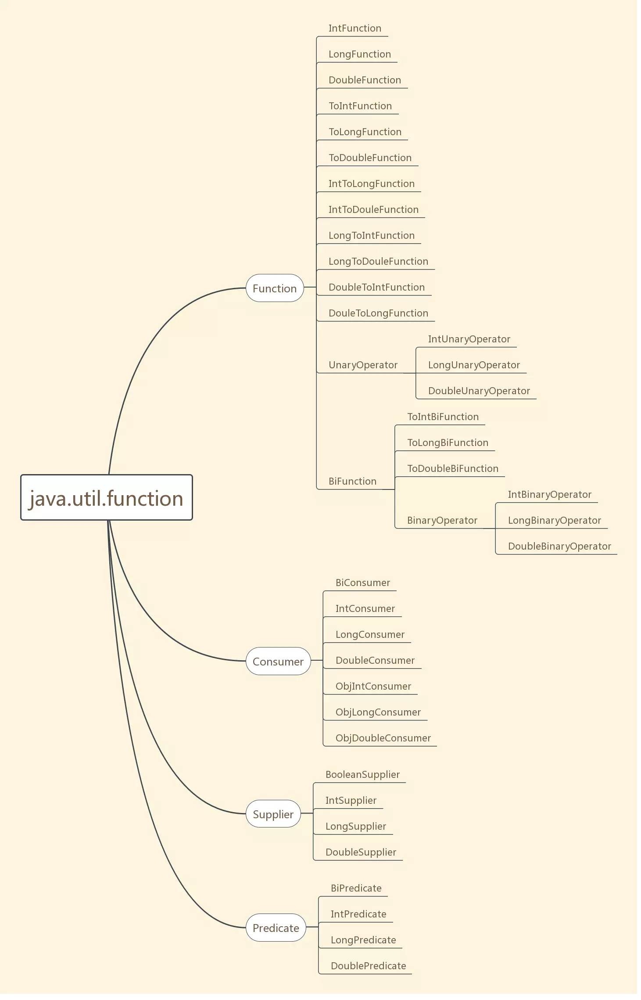
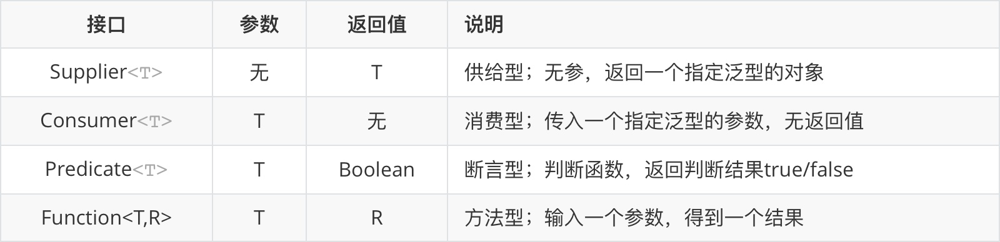
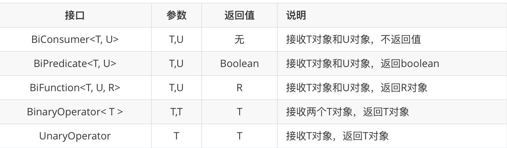

# 函数式接口









函数式接口(Functional Interface)是一个有且仅有一个抽象方法声明的接口。


|  接口   |   |
| :---- | ----  |
| @FunctionalInterface  
public interface Consumer<T>  |  消费者|
| 方法  | 说明 |
| void accept(T t)  | 对给定的参数执行此操作 |
| default Consumer<T> andThen(Consumer<? super T> after)  |  返回一个组合的Consumer ， Consumer执行该操作，后跟after操作。 如果执行任一操作会抛出异常，它将被转发到组合操作的调用者。 如果执行此操作抛出一个异常， after操作将不被执行。  |

```
@FunctionalInterface
public interface Consumer<T> {

    /**
     * 抽象方法：传入一个指定泛型的参数，无返回值
     */
    void accept(T t);

    /**
     * 如同方法名字一样andThen,类似一种相加的功能（下面会举例说明）
     */
    default Consumer<T> andThen(Consumer<? super T> after) {
        Objects.requireNonNull(after);
        return (T t) -> { accept(t); after.accept(t); };
    }
}

```

|  接口   |   |
| :---- | ----  |
| @FunctionalInterface
public interface Supplier<T> |供应者  |
| 方法  | 说明 |
| T get()| 获得结果 |
```
@FunctionalInterface
public interface Supplier<T> {

    /**
     * 只有这一个抽象类
     */
    T get();
}
```


|  接口   |   ||
| :---- | ----  | ---- |
| @FunctionalInterface
public interface Predicate<T> |断言者  ||
| 方法  | 返回值|说明 |
| and(Predicate<? super T> other)| default Predicate<T> 	|短路逻辑AND |
|or(Predicate<? super T> other)|  default Predicate<T> 	|短路逻辑OR|
| negate()| default Predicate<T> 	|逻辑否定 |
|isEqual(Object targetRef)|static <T> Predicate<T> 	|是否相等|
|test(T t)|boolean 	|评估|


```
@FunctionalInterface
public interface Predicate<T> {
    /**
     * 具体过滤操作 需要被子类实现.
     * 用来处理参数T是否满足要求,可以理解为 条件A
     */
    boolean test(T t);
    /**
     * 调用当前Predicate的test方法之后再去调用other的test方法,相当于进行两次判断
     * 可理解为 条件A && 条件B
     */
    default Predicate<T> and(Predicate<? super T> other) {
        Objects.requireNonNull(other);
        return (t) -> test(t) && other.test(t);
    }
    /**
     * 对当前判断进行"!"操作,即取非操作，可理解为 ! 条件A
     */
    default Predicate<T> negate() {
        return (t) -> !test(t);
    }
    /**
     * 对当前判断进行"||"操作,即取或操作,可以理解为 条件A ||条件B
     */
    default Predicate<T> or(Predicate<? super T> other) {
        Objects.requireNonNull(other);
        return (t) -> test(t) || other.test(t);
    }

    /**
     * 对当前操作进行"="操作,即取等操作,可以理解为 A == B
     */
    static <T> Predicate<T> isEqual(Object targetRef) {
        return (null == targetRef)
                ? Objects::isNull
                : object -> targetRef.equals(object);
    }
}
```


|  接口   |   | |
| :---- | ----  | ----  |
| @FunctionalInterface
public interface Function<T,R> |表示接受一个参数并产生结果的函数  |
| 方法  |  返回值 | 说明 |
|andThen(Function<? super R,? extends V> after)| default <V> Function<T,V>  |返回一个组合函数，首先将该函数应用于其输入，然后将 after函数应用于结果 |
|apply(T t)|R|将此函数应用于给定的参数|
|compose(Function<? super V,? extends T> before)|default <V> Function<V,R>|返回一个组合函数，首先将 before函数应用于其输入，然后将此函数应用于结果。如果任一函数的评估引发异常，则将其转发给组合函数的调用者 |
|identity()|static <T> Function<T,T>|返回一个总是返回其输入参数的函数。|
```
@FunctionalInterface
public interface Function<T, R> {
    /**
     * 将参数赋予给相应方法
     * 
     * @param t
     * @return
     */
    R apply(T t);

    /**
     * 先执行参数(即也是一个Function)的，再执行调用者(同样是一个Function)
     */
    default <V> Function<V, R> compose(Function<? super V, ? extends T> before) {
        Objects.requireNonNull(before);
        return (V v) -> apply(before.apply(v));
    }
    /**
     * 先执行调用者，再执行参数，和compose相反。
     */
    default <V> Function<T, V> andThen(Function<? super R, ? extends V> after) {
        Objects.requireNonNull(after);
        return (T t) -> after.apply(apply(t));
    }
    /**
     * 返回当前正在执行的方法
     */
    static <T> Function<T, T> identity() {
        return t -> t;
    }
}
```