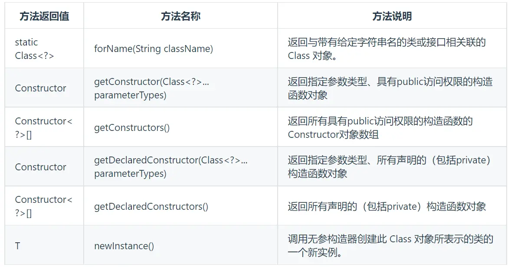

## 反射

### 获取Class对象
获得Class：主要有三种方法：

（1）Object–>getClass

（2）任何数据类型（包括基本的数据类型）都有一个“静态”的class属性

（3）通过class类的静态方法：forName(String className）


（4）使用类的加载器：ClassLoader


```
public class Fanshe {

    public static void main(String[] args) {

       //第一种方式获取Class对象
        Student stu1 = new Student();//这一new 产生一个Student对象，一个Class对象。

        Class stuClass = stu1.getClass();//获取Class对象

        System.out.println(stuClass.getName());
      

       //第二种方式获取Class对象
        Class stuClass2 = Student.class;

        System.out.println(stuClass == stuClass2);//判断第一种方式获取的Class对象和第二种方式获取的是否是同一个

      
      //第三种方式获取Class对象
        try {

            Class stuClass3 = Class.forName("fanshe.Student");//注意此字符串必须是真实路径，就是带包名的类路径，包名.类名

            System.out.println(stuClass3 == stuClass2);//判断三种方式是否获取的是同一个Class对象

        } catch (ClassNotFoundException e) {

            e.printStackTrace();

        }


        // 类加载器
        ClassLoader cl = this.getClass().getClassLoader();
        Class clazz4 = cl.loadClass(“类的全类名”);

    }
}

```

### Class 类


### 构造器 constructor

#### 获取构造器




#### 构造器 api
