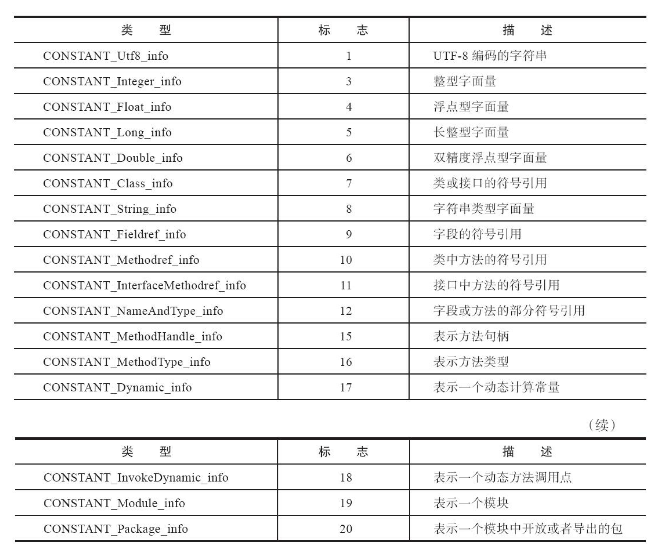
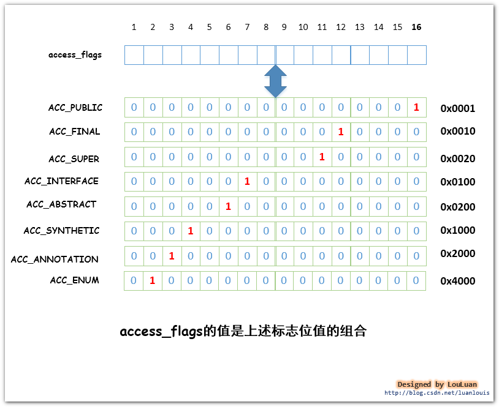
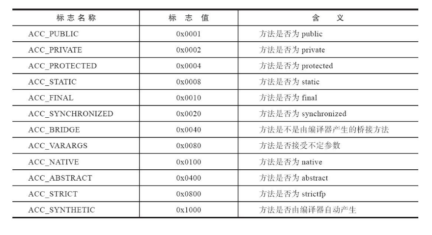

# java class 文件


## class 文件数据结构
```
ClassFile { 
    u4 magic;  # 魔数
    u2 minor_version;  #副版本
    u2 major_version;  # 主版本
    u2 constant_pool_count;  #常量池计数器
    cp_info constant_pool[constant_pool_count-1];  #常量池
    u2 access_flags;  #访问标志
    u2 this_class; #类索引
    u2 super_class; #父类索引
    u2 interfaces_count; #接口计数器
    u2 interfaces[interfaces_count]; #接口表
    u2 fields_count; #字段计数器
    field_info fields[fields_count]; #字段表
    u2 methods_count; #方法计数器
    method_info methods[methods_count]; #方法表
    u2 attributes_count; #属性计数器
    attribute_info attributes[attributes_count]; #属性表
}
```
### 数据类型
| 类型 | 说明 | 
| ------ | ------ | 
| u1 | 1字节无符号数 | 
| u2 | 2字节无符号数 |
| u4 | 4字节无符号数 |
| u8 | 8字节无符号数 |


### 魔数与版本
```
magic：

　　魔数
        魔数的唯一作用是确定这个文件是否为一个能被虚拟机所接受的Class文件。魔数值固定为0xCAFEBABE，不会改变。
```
```
minor_version、major_version：

　　 分别为Class文件的副版本和主版本。
    它们共同构成了Class文件的格式版本号。
    不同版本的虚拟机实现支持的Class文件版本号也相应不同，高版本号的虚拟机可以支持低版本的Class文件，反之则不成立。
```

### 常量池(非常重要的东西)

```
constant_pool_count：

　　常量池计数器，constant_pool_count的值等于constant_pool表中的成员数加1
```
```
constant_pool[constant_pool_count]

    常量池，constant_pool是一种表结构
    常量池的索引范围是1至constant_pool_count−1

    主要存放两大常量:
    1 字面量
    2 符号引用
```

#### 常量池中的两大常量

- 字面量

- 符号引用
    ```
    类和接口的全限定名

    字段名称与描述符

    方法名称与描述符

    方法句柄与方法类型

    动态调用点和动态常量

    模块与包

    ```

##### 描述符
- 类(引用类型)
- 基础类型
- 数组
- 方法
  
###### 类描述符
以L开头，其后跟着该类的全限定名，并将其中中的 “.” 改为 “/” ，最后分号“；”结束

```
类: java.lang.String
描述符: Ljava/lang/String
```

###### 基础类型描述符

|类型分类|java类型 	|标志	|
| ------ | ------ | ------ |
|基本数据类型|byte|B|
|基本数据类型|char|C|
|基本数据类型|double|D|
|基本数据类型|float|F|
|基本数据类型|int|I|
|基本数据类型|long|J|
|基本数据类型|short|S|
|基本数据类型|boolean|Z|
|基本数据类型|void|V|

###### 数组描述符
以[表示数组维度，[表示一维数组，[[表示二维数组，以此类推
```
数组: String[][] ss;
描述符: [[Ljava/lang/String


数组: int[] i;
描述符：[I
```

###### 方法描述符
规则: (方法参数1类型描述符方法参数2类型描述符)返回值类型描述符

```
方法： String test(int i, Object obj);
描述符: (ILjava/lang/Object;)Ljava/lang/String;
```

#### 常量池中的表



##### CONSTANT_Utf8_info 表 结构

|常量	|项目	|类型    | 描述     |
| ------ | ------ | ----- | ----- | 
||tag|u1|常量类型标志  值为1|
|CONSTANT_Utf8_info|legth|u2|utf8字符串字节长度|
||bytes|u1|字符串|

##### CONSTANT_Integer_info 表 结构

|常量	|项目	|类型    | 描述     |
| ------ | ------ | ----- | ----- | 
|CONSTANT_Integer_info|tag|u1|常量类型标志  值为3|
||bytes|u4|int值|

##### CONSTANT_Float_info 表 结构

|常量	|项目	|类型    | 描述     |
| ------ | ------ | ----- | ----- | 
|CONSTANT_Float_info|tag|u1|常量类型标志  值为4|
||bytes|u4|float值|

##### CONSTANT_Long_info 表 结构

|常量	|项目	|类型    | 描述     |
| ------ | ------ | ----- | ----- | 
|CONSTANT_Long_info|tag|u1|常量类型标志  值为5|
||bytes|u8|long值|


##### CONSTANT_Double_info 表 结构

|常量	|项目	|类型    | 描述     |
| ------ | ------ | ----- | ----- | 
|CONSTANT_Double_info|tag|u1|常量类型标志  值为6|
||bytes|u8|long值|


##### CONSTANT_Class_info 表 结构

|常量	|项目	|类型    | 描述     |
| ------ | ------ | ----- | ----- | 
|CONSTANT_Class_info|tag|u1|常量类型标志  值为7|
||index|u2|指向全限定名常量项的索引|

##### CONSTANT_String_info 表 结构

|常量	|项目	|类型    | 描述     |
| ------ | ------ | ----- | ----- | 
|CONSTANT_String_info|tag|u1|常量类型标志  值为8|
||index|u2|指向字符串字面量的索引|

##### CONSTANT_Fieldref_info 表 结构

|常量	|项目	|类型    | 描述     |
| ------ | ------ | ----- | ----- | 
|CONSTANT_Fieldref_info|tag|u1|常量类型标志  值为9|
||index|u2|指向声明字段的类或者接口的CONSTANT_Class_info的索引|
||index|u2|指向名称和类型描述符CONSTANT_NameAndType_info的索引项|


##### CONSTANT_Methodref_info 表 结构

|常量	|项目	|类型    | 描述     |
| ------ | ------ | ----- | ----- | 
|CONSTANT_Methodref_info|tag|u1|常量类型标志  值为10|
||index|u2|指向声明方法类描述符的CONSTANT_Class_info的索引|
||index|u2|指向名称和类型描述符CONSTANT_NameAndType_info的索引项|

##### CONSTANT_InterfaceMethodref_info 表 结构

|常量	|项目	|类型    | 描述     |
| ------ | ------ | ----- | ----- | 
|CONSTANT_String_info|tag|u1|常量类型标志  值为11|
||index|u2|指向声明方法接口描述符的CONSTANT_Class_info的索引|
||index|u2|指向名称和类型描述符CONSTANT_NameAndType_info的索引项|


##### CONSTANT_NameAndType_info 表 结构

|常量	|项目	|类型    | 描述     |
| ------ | ------ | ----- | ----- | 
|CONSTANT_NameAndType_info|tag|u1|常量类型标志  值为12|
||index|u2|指向字段或方法名称的常量项索引|
||index|u2|指向字段或方法描述符常量项索引|

##### CONSTANT_MethodHandle_info 表 结构

|常量	|项目	|类型    | 描述     |
| ------ | ------ | ----- | ----- | 
|CONSTANT_MethodHandle_info|tag|u1|常量类型标志  值为15|
||reference_kind|u1|[1-9] 决定句柄类型，表示句柄的字节码行为|
||reference_index|u2|常量池的有效索引|


##### CONSTANT_MethodType_info 表 结构

|常量	|项目	|类型    | 描述     |
| ------ | ------ | ----- | ----- | 
|CONSTANT_MethodType_info|tag|u1|常量类型标志  值为16|
||descripor_index|u2|CONDTANT_Utf8_info表常量，方法描述符|


##### CONSTANT_Dynamic_info 表 结构

|常量	|项目	|类型    | 描述     |
| ------ | ------ | ----- | ----- | 
|CONSTANT_Dynamic_info|tag|u1|常量类型标志  值为17|
||bootstrap_method_attr_index|u2|引导方法表 bootstrap_methods[]数组的有效索引|
||name_and_type_index|u2|CONSTANT_NameAndType_info，方法名和方法描述符|


##### CONSTANT_InvokeDynamic_info 表 结构

|常量	|项目	|类型    | 描述     |
| ------ | ------ | ----- | ----- | 
|CONSTANT_InvokeDynamic_info|tag|u1|常量类型标志  值为18|
||bootstrap_method_attr_index|u2|引导方法表 bootstrap_methods[]数组的有效索引|
||name_and_type_index|u2|CONSTANT_NameAndType_info，方法名和方法描述符|

##### CONSTANT_Module_info 表 结构

|常量	|项目	|类型    | 描述     |
| ------ | ------ | ----- | ----- | 
|CONSTANT_Module_info|tag|u1|常量类型标志  值为19|
||name_index|u2|CONDTANT_Utf8_info，模块名称|


##### CONSTANT_Package_info 表 结构

|常量	|项目	|类型    | 描述     |
| ------ | ------ | ----- | ----- | 
|CONSTANT_Package_info|tag|u1|常量类型标志  值为20|
||name_index|u2|CONDTANT_Utf8_info，包名称|


### 类访问标志

|标记名 	|值 	|含义|
| ------ | ------ | ----- | 
|ACC_PUBLIC 	|0x0001 	|是否被public修饰，可以被包的类外访问。|
|ACC_FINAL |	0x0010 	|是否被final修饰，不允许有子类。|
|ACC_SUPER |	0x0020 	|当用到invokespecial指令时，需要特殊处理的父类方法。|
|ACC_INTERFACE 	|0x0200 	|标识定义的是接口。|
|ACC_ABSTRACT 	|0x0400 	|是否为abstract类型，对于接口或抽象类，此标志为真|
|ACC_SYNTHETIC 	|0x1000 	|标识该类为编译器生成，非用户代码产生|
|ACC_ANNOTATION 	|0x2000 	|标识注解类型|
|ACC_ENUM |0x4000 	|标识枚举类型|
|ACC_MODULE |0x8000 	|标识模块|





### 类索引
```
 this_class  u2类型数据
类索引，this_class的值必须为CONSTANT_Class_info类型常量，
表示这个Class文件所定义的类或接口。
指出class文件所描述的这个类的名称
```


### 父类索引
```
 super_class u2类型数据
父类索引，super_class的值必须为0或者是对constant_pool表中项目的一个有效索引值。

如果它的值不为0，
那constant_pool表在这个索引处的项必须是CONSTANT_Class_info类型常量，表示这个Class文件所定义的类的直接父类。对于接口来说，它的Class文件的super_class项的值必须是对constant_pool表中项目的一个有效索引值。constant_pool表在这个索引处的项必须为代表java.lang.Object的CONSTANT_Class_info类型常量。

如果Class文件的super_class的值为0，那这个Class文件只可能是定义的是java.lang.Object类，只有它是唯一没有父类的类。
```

### 接口索引集合

##### 接口计数器
```
interfaces_count

    接口计数器
    interfaces_count的值表示当前类或接口的直接父接口数量。

```
    
##### 接口表
```
interfaces[]

    接口表
    interfaces[]数组中的每个成员的值必须是一个对constant_pool表中项目的一个有效索引值，它的长度为interfaces_count。
    每个成员interfaces[i] 必须为CONSTANT_Class_info类型常量，其中0 ≤ i < interfaces_count。
    在interfaces[]数组中，成员所表示的接口顺序和对应的源代码中给定的接口顺序（从左至右）一样，即interfaces[0]对应的是源代码中最左边的接口。

```


### 字段表
##### 字段计数器
```
fields_count

    字段计数器
    fields_count的值表示当前Class文件fields[]数组的成员个数。
    fields[]数组中每一项都是一个field_info结构的数据项，它用于表示该类或接口声明的类字段或者实例字段。
```
##### 字段表
```
fields[]
    字段表
    fields[]数组中的每个成员都必须是一个fields_info结构的数据项，用于表示当前类或接口中某个字段的完整描述。
    fields[]数组描述当前类或接口声明的所有字段，但不包括从父类或父接口继承的部分。
```
##### 字段表结构
|类型 	  |名称	   |说明   | 数量  |
| ------ | ------ | ----- | ----- | 
|u2 	|acces_flags 	|字段访问标志|1|
|u2 |	name_index 	| 字段简单名称索引项|1|
|u2 |	descriptor_index 	|字段描述符索引项，主要是字段类型|1|
|u2 	|attribute_count 	|属性表成员个数|1|
|attribute_info 	|attributes|字段属性表 	|attribute_count|

##### 字段访问标志
|标志名称 	  |标志值	   |说明   |
| ------ | ------ | ----- | ----- | 
|ACC_PUBLIC 	|0x0001 	|是否public标识|
|ACC_PRIVATE 	|0x0002 	|是否private标识|
|ACC_PROTECTED 	|0x0004 	|是否protected标识|
|ACC_STATIC 	|0x0008 	|是否static标识|
|ACC_FINAL 	    |0x0010 	|是否final标识|
|ACC_VOLATILE 	|0x0040 	|是否volatile标识|
|ACC_TRANSIENT 	|0x0080 	|是否transient标识|
|ACC_SYNTHETIC 	|0x1000 	|字段是否由编译器生成|
|ACC_ENUM 	|0x4000 	|是否是枚举|

### 方法表
##### 方法计数器
```
methods_count

    方法计数器
    methods_count的值表示当前Class文件methods[]数组的成员个数。
    Methods[]数组中每一项都是一个method_info结构的数据项。
```
##### 方法表
```
methods[]
    方法表
    methods[]数组中的每个成员都必须是一个method_info结构的数据项，用于表示当前类或接口中某个方法的完整描述。
    如果某个method_info结构的access_flags项既没有设置ACC_NATIVE标志也没有设置ACC_ABSTRACT标志，那么它所对应的方法体就应当可以被Java虚拟机直接从当前类加载，而不需要引用其它类。
    method_info结构可以表示类和接口中定义的所有方法，包括实例方法、类方法、实例初始化方法方法和类或接口初始化方法方法。
    methods[]数组只描述当前类或接口中声明的方法，不包括从父类或父接口继承的方法。

```
##### 方法表结构
|类型 	  |名称	   |说明   | 数量  |
| ------ | ------ | ----- | ----- | 
|u2 	|acces_flags 	|字段访问标志|1|
|u2 |	name_index 	| 方法简单名称索引项|1|
|u2 |	descriptor_index 	|方法描述符索引项|1|
|u2 	|attribute_count 	|属性表成员个数|1|
|attribute_info 	|attributes|方法属性表 	|attribute_count|


##### 方法访问标志


##### 方法的特征签名
使用方法签名判断方法是否一样，在java代码中同一个类中不能出现方法简单名称和参数列表一样的方法，但是在java代码编译后的字节码中，同一个类中允许出现方法简单名称和参数列表一致，但返回值不一致的方法，比如编译器生成的桥接方法

java代码的方法特征签名包含：
- 方法简单名称
- 方法参数类型
- 方法参数列表中参数顺序

java字节码方法特征签名包含:
- 方法简单名称
- 方法参数类型
- 方法参数列表中参数顺序
- 返回值类型
- 异常表


### 属性表集合
class文件、字段表、方法表、code属性 都拥有自己的属性表。


##### 预定义属性
|属性名称 	  |使用位置	   |说明   |
| ------ | ----- | ----- | 
| ------ | class文件、方法表、字段表、code属性 | ----- | 
|Deprecated 	|class文件、方法表、字段表 	|声明类失效|
|Signature|class文件、方法表、字段表|(java5新增)记录泛型签名|
|Synthetic|class文件、方法表、字段表|编译器自动生成|
|RuntimeVisibleAnnotations|class文件、方法表、字段表|(java5新增)指明注解运行时(反射调用)可见|
|RuntimeInvisibleAnnotations|class文件、方法表、字段表|(java5新增)指明注解运行时(反射调用)不可见|
|RuntimeVisibleTypeAnnotations|class文件、方法表、字段表、code属性|(java8新增)为实现JSR 308新增的类型注解提供支持，指明注解运行时(反射调用)可见|
|RuntimeInvisibleTypeAnnotations|class文件、方法表、字段表、code属性|(java8新增)为实现JSR 308新增的类型注解提供支持，指明注解运行时(反射调用)不可见|
|----|class文件|----|
|EnclosingMethod 	|class文件 	|当一个类是局部类或匿名类时拥有该属性，用于标识该类所在的外围方法|
|InnerClasses|Class文件|内部类列表|
|SourceFile|Class文件|记录源文件名称|
|SourceDebugExtension|Class文件|(java5新增)非java语言编写，需要编译为字节码在虚拟机中运行，使用该属性记录调试信息|
|BootstrapMethods|Class文件|(java7新增)用于保存invokedynamic指令引用的引导方法限定符|
|Module|Class文件|(java9新增) 记录Module信息|
|ModuleMainClass|Class文件|(java9新增) 记录Module主类信息|
|ModulePackages|Class文件|(java9新增) 记录Module中的包|
|NestHost|Class文件|(java11)内部类通过该属性获取自己的宿主类信息|
|NestMembers|Class文件|(java11)宿主类通过该属性获取有哪些内部类|
|-----|字段表|----|
|ConstantValue|字段表|由final关键字修饰的常量值|
|-----|方法表|----|
|Code|方法表|方法体代码编译后的字节指令|
|Exceptions|方法表|方法抛出的异常列表|
|RuntimeVisibleParameterAnnotations|方法表|(java5新增)指明方法参数上注解在运行时可见|
|RuntimeInvisibleParameterAnnotations|方法表|(java5新增)指明方法参数上注解在运行时不可见|
|AnnotationDefault|方法表|(java5新增)记录注解默认值|
|MethodParameters|方法表|(java8新增)记录方法的形参名称和信息(编译时加上 -parameters 参数)|
|-----|Code属性|----|
|LineNumberTable|Code属性|源码行号与字节码指令的关系|
|LocalVariableTable|Code属性|方法中局部变量描述|
|LocalVariableTypeTable|Class文件|(java5新增) 方法中泛型局部变量描述|
|StackMapTable|Code属性|(java6新增)类型检查|


##### Code属性

```
Code_attribute {
   u2 attribute_name_index;
   u4 attribute_length;
   u2 max_stack;
   u2 max_locals;
   u4 code_length;
   u1 code[code_length];
   u2 exception_table_length;
   {   u2 start_pc;
       u2 end_pc;
       u2 handler_pc;
       u2 catch_type;
   }   exception_table[exception_table_length];
   u2 attributes_count;
   attribute_info attributes[attributes_count];
}
```
Code属性表结构

|类型 	  |名称	   |数量   |说明  |
| ------ | ------ | ----- | ----- | 
|u2|attribute_name_index|1|属性名称 固定Code|
|u4|attribute_length|1|属性值长度|
|u2|max_stack|1|操作数栈最大深度|
|u2|max_locals|1|局部变量表所需的存储空间大小|
|u4|code_length|1|方法编译后的字节码长度|
|u1|code|1|字节码指令|
|u2|exception_table_length|1||
|exception_info|exception_table|1||
|u2|attributes_count|1||
|attribute_info|attributes|1||

###### max_locals

###### exception_info
异常表结构
|类型 	  |名称	   |数量   |说明  |
|u2|start_pc|1|开始指令地址|
|u2|end_pc|1|结束指令地址|
|u2|handler_pc|1|跳转执行异常的指令地址|
|u2|catch_type|1|捕获的异常类型|

```
方法中 try {} catch(){} 语句，而不是方法声明中 throw 的异常。
- start_pc : 开始指令地址，包括它。
- end_pc : 结束指令地址，不包括它。
- handler_pc : 跳转执行异常的指令地址。
- catch_type : CONSTANT_Class_info 类型常量池有效索引，表示这个异常的类型。
```


###### 


##### Exceptions属性


```
Classfile TestInterface.class
  Last modified 2023-1-9; size 447 bytes
  MD5 checksum 59236ee50ea717d9c4e3f9a64101361a
  Compiled from "TestInterface.java"
public interface base.TestInterface
  minor version: 0
  major version: 52
  flags: ACC_PUBLIC, ACC_INTERFACE, ACC_ABSTRACT
Constant pool:
   #1 = Fieldref           #16.#17        // java/lang/System.out:Ljava/io/PrintStream;
   #2 = String             #18            // TestInterface.test
   #3 = Methodref          #19.#20        // java/io/PrintStream.println:(Ljava/lang/String;)V
   #4 = Class              #21            // base/TestInterface
   #5 = Class              #22            // java/lang/Object
   #6 = Utf8               testDefault
   #7 = Utf8               ()V
   #8 = Utf8               Code
   #9 = Utf8               LineNumberTable
  #10 = Utf8               LocalVariableTable
  #11 = Utf8               this
  #12 = Utf8               Lbase/TestInterface;
  #13 = Utf8               test
  #14 = Utf8               SourceFile
  #15 = Utf8               TestInterface.java
  #16 = Class              #23            // java/lang/System
  #17 = NameAndType        #24:#25        // out:Ljava/io/PrintStream;
  #18 = Utf8               TestInterface.test
  #19 = Class              #26            // java/io/PrintStream
  #20 = NameAndType        #27:#28        // println:(Ljava/lang/String;)V
  #21 = Utf8               base/TestInterface
  #22 = Utf8               java/lang/Object
  #23 = Utf8               java/lang/System
  #24 = Utf8               out
  #25 = Utf8               Ljava/io/PrintStream;
  #26 = Utf8               java/io/PrintStream
  #27 = Utf8               println
  #28 = Utf8               (Ljava/lang/String;)V
{
  public void testDefault();
    descriptor: ()V
    flags: ACC_PUBLIC
    Code:
      stack=2, locals=1, args_size=1
         0: getstatic     #1                  // Field java/lang/System.out:Ljava/io/PrintStream;
         3: ldc           #2                  // String TestInterface.test
         5: invokevirtual #3                  // Method java/io/PrintStream.println:(Ljava/lang/String;)V
         8: return
      LineNumberTable:
        line 6: 0
        line 7: 8
      LocalVariableTable:
        Start  Length  Slot  Name   Signature
            0       9     0  this   Lbase/TestInterface;

  public abstract void test();
    descriptor: ()V
    flags: ACC_PUBLIC, ACC_ABSTRACT
}
SourceFile: "TestInterface.java"

```

```
Classfile TestClass.class
  Last modified 2023-1-9; size 600 bytes
  MD5 checksum 5cef0289a12d56f17d61f3ee141be0c4
  Compiled from "TestClass.java"
public class base.TestClass extends base.TestBaseClass
  minor version: 0
  major version: 52
  flags: ACC_PUBLIC, ACC_SUPER
Constant pool:
   #1 = Methodref          #5.#22         // base/TestBaseClass."<init>":()V
   #2 = Fieldref           #4.#23         // base/TestClass.name:Ljava/lang/String;
   #3 = Methodref          #5.#24         // base/TestBaseClass.getName:()Ljava/lang/String;
   #4 = Class              #25            // base/TestClass
   #5 = Class              #26            // base/TestBaseClass
   #6 = Utf8               name
   #7 = Utf8               Ljava/lang/String;
   #8 = Utf8               <init>
   #9 = Utf8               ()V
  #10 = Utf8               Code
  #11 = Utf8               LineNumberTable
  #12 = Utf8               LocalVariableTable
  #13 = Utf8               this
  #14 = Utf8               Lbase/TestClass;
  #15 = Utf8               setName
  #16 = Utf8               (Ljava/lang/String;)V
  #17 = Utf8               getName
  #18 = Utf8               ()Ljava/lang/String;
  #19 = Utf8               getSuperName
  #20 = Utf8               SourceFile
  #21 = Utf8               TestClass.java
  #22 = NameAndType        #8:#9          // "<init>":()V
  #23 = NameAndType        #6:#7          // name:Ljava/lang/String;
  #24 = NameAndType        #17:#18        // getName:()Ljava/lang/String;
  #25 = Utf8               base/TestClass
  #26 = Utf8               base/TestBaseClass
{
  public base.TestClass();
    descriptor: ()V
    flags: ACC_PUBLIC
    Code:
      stack=1, locals=1, args_size=1
         0: aload_0
         1: invokespecial #1                  // Method base/TestBaseClass."<init>":()V
         4: return
      LineNumberTable:
        line 3: 0
      LocalVariableTable:
        Start  Length  Slot  Name   Signature
            0       5     0  this   Lbase/TestClass;

  public void setName(java.lang.String);
    descriptor: (Ljava/lang/String;)V
    flags: ACC_PUBLIC
    Code:
      stack=2, locals=2, args_size=2
         0: aload_0
         1: aload_1
         2: putfield      #2                  // Field name:Ljava/lang/String;
    flags: ACC_PUBLIC
    Code:
      stack=1, locals=1, args_size=1
         0: aload_0
         1: invokespecial #3                  // Method base/TestBaseClass.getName:()Ljava/lang/String;
         4: areturn
      LineNumberTable:
        line 18: 0
      LocalVariableTable:
        Start  Length  Slot  Name   Signature
            0       5     0  this   Lbase/TestClass;
}
SourceFile: "TestClass.java"

```