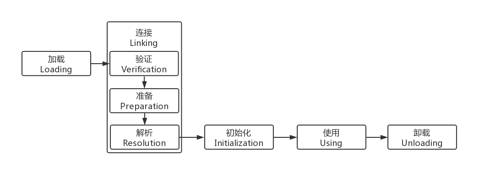

# java 类加载

##  类加载器
<B>类的加载指的是将类的.class文件中的二进制数据读入到内存中，将其放在运行时数据区的方法区内，然后在堆区创建一个 java.lang.Class对象，用来封装类在方法区内的数据结构</B>

#### 加载过程

##### 链接
  
###### 验证

验证的主要作用就是确保被加载的类的正确性。

四个阶段的验证：

- 文件格式的验证

- 元数据验证

- 字节码验证

- 符号引用验证

###### 准备
正式为类变量分配内存并设置类变量初始值的阶段，这些内存都将在方法区中进行分配

###### 解析

- 符号引用与直接引用

 符号引用（Symbolic Reference）：符号引用以一组符号来描述所引用的目标，符号引用可以是任何形式的字面量，符号引用与虚拟机实现的内存布局无关，引用的目标并不一定已经在内存中。 

直接引用（Direct Reference）：直接引用可以是直接指向目标的指针、相对偏移量或是一个能间接定位到目标的句柄。直接引用是与虚拟机实现的内存布局相关的，同一个符号引用在不同的虚拟机实例上翻译出来的直接引用一般都不相同，如果有了直接引用，那引用的目标必定已经在内存中存在。

 解析阶段是虚拟机将常量池内的符号引用替换为直接引用的过程

 1、类或接口的解析：判断所要转化成的直接引用是对数组类型，还是普通的对象类型的引用，从而进行不同的解析。 

2、字段解析：对字段进行解析时，会先在本类中查找是否包含有简单名称和字段描述符都与目标相匹配的字段，如果有，则查找结束；如果没有，则会按照继承关系从上往下递归搜索该类所实现的各个接口和它们的父接口，还没有，则按照继承关系从上往下递归搜索其父类，直至查找结束。 

3、类方法解析：对类方法的解析与对字段解析的搜索步骤差不多，只是多了判断该方法所处的是类还是接口的步骤，而且对类方法的匹配搜索，是先搜索父类，再搜索接口。 

4、接口方法解析：与类方法解析步骤类似，只是接口不会有父类，因此，只递归向上搜索父接口就行了。 

“动态解析”的含义就是必须等到程序实际运行到这条指令的时候，解析动作才能进行。相对的，其余可触发解析的指令都是“静态”的，可以在刚刚完成加载阶段，还没有开始执行代码时就进行解析。

##### 初始化

初始化时机：

 - 创建类的实例
- 访问某个类或接口的静态变量（助记符：getstatic）或者对该静态变量赋值（助记符：putstatic）
- 调用类的静态方法（助记符：invokestatic）
- 反射（如Class.forName("com.test.Test")）
- 初始化一个类的子类
- Java虚拟机启动时被标明为启动类的类（Java Test，即含有main()方法的类）
- JDK1.7开始提供的动态语言支持：
java.lang.invoke.MethodHandle实例的解析结果REF_getStatic,REF_putStatic,REF_invokeStatic句柄对应的类没有初始化，则初始化

注意：
（但static final的常量除外，它在常量池中），

---

####双亲委派

   1）启动（Bootstrap）类加载器：是用本地代码实现的类装入器，它负责将 <Java_Runtime_Home>/lib下面的类库加载到内存中（比如rt.jar）。由于引导类加载器涉及到虚拟机本地实现细节，开发者无法直接获取到启动类加载器的引用，所以不允许直接通过引用进行操作。 

     2）标准扩展（Extension）类加载器：是由 Sun 的 ExtClassLoader（sun.misc.Launcher$ExtClassLoader）实现的。它负责将< Java_Runtime_Home >/lib/ext或者由系统变量 java.ext.dir指定位置中的类库加载到内存中。开发者可以直接使用标准扩展类加载器。 

     3）系统（System）类加载器：是由 Sun 的 AppClassLoader（sun.misc.Launcher$AppClassLoader）实现的。它负责将系统类路径（CLASSPATH）中指定的类库加载到内存中。开发者可以直接使用系统类加载器。 

双亲委派机制描述： 
     某个特定的类加载器在接到加载类的请求时，首先将加载任务委托给父类加载器，依次递归，如果父类加载器可以完成类加载任务，就成功返回；只有父类加载器无法完成此加载任务时，才自己去加载。 
 

---

#### 破话双亲委派机制